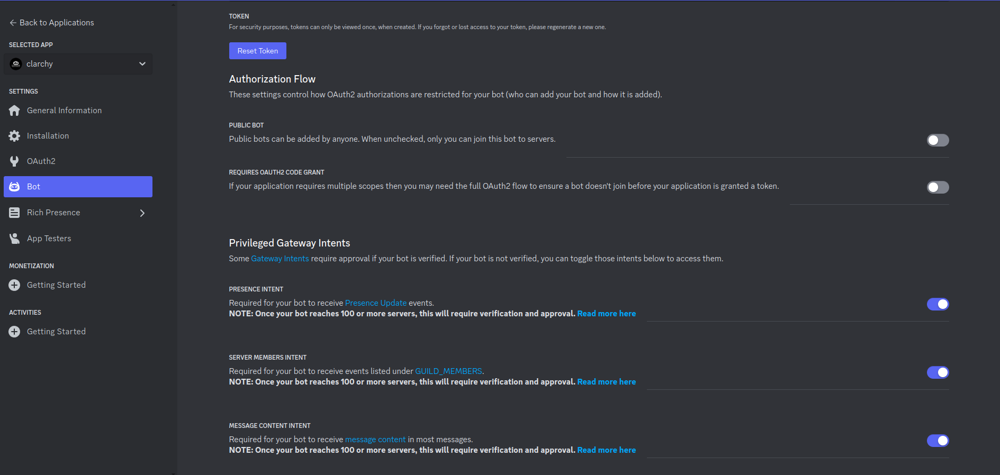
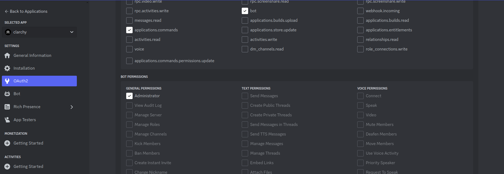

# Nodejs/TS Discord bot to fetch the top messages in a channel


### Project setup

**Step 1:**
Create a Discord application at https://discord.com/developers/


**Step 2:**
Set permissions




Make sure to open the generated link in the browser and give access to the relevant discord server/guild

**Step 3:**

Copy `token` from bot section in discord application and the `channel_id` from the browser tab url for the interested channel in the `.env` file in root directory

```env
TOKEN="something like this => abcdef.pqrst.xyz__v4"
CHANNEL_ID="something like this => 2354235423452345234532"
```


**Step 4:**

Please make sure Nodejs v20.9.0 or near is installed, then Run 

 ```sh
 npm install
 npm run start
 ```


### References

* Understanding the fetch API https://discord.js.org/docs/packages/discord.js/14.14.1/MessageManager:Class#fetch
* Discord API documentation https://www.postman.com/discord-api/workspace/discord-api/overview